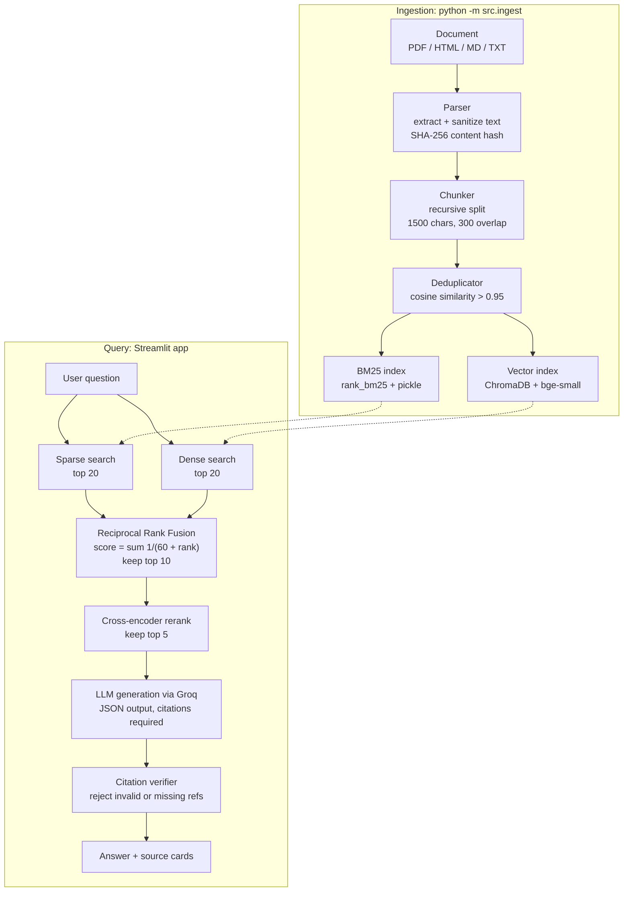

# Hybrid Retrieval-Augmented Generation (RAG) System

Ask questions about your documents and get answers that cite exactly which passages they came from.

The system combines **keyword search (BM25)** with **semantic search (vector embeddings)**, merges the two rankings with **Reciprocal Rank Fusion**, reranks the survivors with a **cross-encoder**, and asks an LLM to answer **using only the retrieved text**, with a bracketed citation after every claim. A verifier then checks those citations mechanically before the answer reaches the screen.

Every retrieval stage is measured against a hand-labelled benchmark, so the design choices are backed by numbers rather than assumptions.

---

## Table of contents

- [Why hybrid retrieval](#why-hybrid-retrieval)
- [Architecture](#architecture)
- [How it works, stage by stage](#how-it-works-stage-by-stage)
- [Results](#results)
- [Quickstart](#quickstart)
- [Usage](#usage)
- [Project structure](#project-structure)
- [Configuration](#configuration)
- [Engineering notes](#engineering-notes)
- [Known limitations](#known-limitations)
- [Roadmap](#roadmap)
- [Tech stack](#tech-stack)
- [License](#license)

---

## Why hybrid retrieval

Neither search method is enough on its own:

| Method | Strong at | Weak at |
|---|---|---|
| **BM25 (keyword)** | Exact terms: policy names, codes, numbers, rare words | Paraphrases — "time off" will not match "annual leave" |
| **Dense vectors (semantic)** | Meaning and paraphrase | Exact identifiers, which embeddings tend to blur |

Fusing both gives a measurable gain on this benchmark: Recall@5 rises from **0.630** (BM25 alone) and **0.813** (dense alone) to **0.823**, with MRR at **0.900**.

---

## Architecture



---

## How it works, stage by stage

### 1. Parsing (`src/ingestion/parsers.py`)

Routes each file to a parser: `pypdf` for PDFs (page markers are kept as `[Page n]`), BeautifulSoup for HTML, plain reads for Markdown and TXT. The extracted text is then sanitized surrogate characters and null bytes removed, PDF bullet glyphs normalised, whitespace collapsed because raw PDF text breaks downstream validation and embeddings.

Each document gets an ID derived from the **SHA-256 hash of its cleaned text**, which makes ingestion reproducible (see [Engineering notes](#engineering-notes)).

### 2. Chunking (`src/ingestion/chunkers.py`)

Four strategies are implemented; `production_chunk()` picks one by file type structure-aware splitting for Markdown and HTML (splits on headings, keeps small sections whole), recursive splitting for everything else.

Recursive splitting tries progressively finer boundaries paragraph → line → sentence → word — so a chunk rarely ends mid-sentence. Overlap from the previous chunk is prepended to keep context across boundaries.

### 3. Deduplication (`src/ingestion/deduplicator.py`)

Chunks are embedded in bulk and dropped when cosine similarity with a recently accepted chunk exceeds `0.95`. Repeated headers and boilerplate would otherwise crowd out real answers.

### 4. Indexing

- **Sparse** (`src/retrieval/sparse.py`): BM25-Okapi over tokenized text (lowercased, stopwords removed, hyphenated terms preserved), persisted to `data/sparse_index.pkl`. Chunks already present are skipped by ID.
- **Dense** (`src/retrieval/dense.py`): ChromaDB with cosine space and a local sentence-transformer embedding function, persisted in `data/chroma_db/`. Writes use `upsert`, so re-indexing the same chunk replaces it instead of duplicating it.

### 5. Hybrid retrieval (`src/retrieval/hybrid_retrieval.py`)

Both indexes are queried for twice the requested depth, then fused with Reciprocal Rank Fusion:

```
score(chunk) = Σ  1 / (k + rank)        k = 60
```

RRF works on **ranks, not scores**, which avoids having to normalise BM25 scores against cosine similarities two scales that are not comparable. A chunk found by both retrievers accumulates score from both lists and rises to the top. `k = 60` is the value from the original RRF paper (Cormack et al., 2009); it softens the gap between adjacent ranks so no single list dominates.

### 6. Reranking (`src/reranking/cross_encoder.py`)

A cross-encoder scores each `(query, chunk)` pair with full cross-attention, which is more accurate than comparing independent embeddings but too slow for a whole corpus so it runs only on the fused candidates. **On this benchmark it did not improve results** (see [Results](#results)).

### 7. Grounded generation (`src/generation/generator.py`)

The prompt restricts the model to the supplied context blocks, requires a bracketed citation such as `[1]` after each factual claim, and forces a JSON response:

```json
{ "answer": "Employees must maintain a neat appearance [2].", "is_context_sufficient": true }
```

When the context does not contain the answer, the model is instructed to set `is_context_sufficient` to `false` and return a fixed refusal, rather than improvising.

### 8. Citation verification (`src/generation/verifier.py`)

Every `[n]` in the answer is checked: it must point to a real context block that actually contains text, and an answer with no citations at all is rejected. Results are surfaced in the UI as **Context sufficient** and **Citations verified** badges, with any flagged issues listed.

This is a **structural** check. It proves a citation points somewhere real; it does not prove the cited passage supports the sentence. Semantic checking is on the [roadmap](#roadmap).

---

## Results

Benchmark: **25 hand-labelled questions** over a 31-page policy document (46 chunks, 35 labelled relevant chunk IDs). Generated with `evaluation/find_relevant_chunks.py`, scored with `evaluation/evaluate_retrieval.py`.

| System | R@1 | R@5 | R@10 | R@20 | MRR | NDCG@5 | NDCG@10 |
|---|---|---|---|---|---|---|---|
| Sparse BM25 | 0.410 | 0.630 | 0.840 | 0.920 | 0.808 | 0.630 | 0.716 |
| Dense Vector | 0.430 | 0.813 | 0.913 | 0.973 | 0.850 | 0.770 | 0.814 |
| **Hybrid RRF** | **0.470** | **0.823** | 0.890 | **0.983** | **0.900** | **0.785** | **0.815** |
| Hybrid + Cross-Encoder | 0.363 | 0.773 | **0.937** | **0.983** | 0.833 | 0.710 | 0.777 |

**Reading the numbers**

- **Hybrid retrieval is the best configuration**: +19.3 points of Recall@5 over BM25 alone, and ahead of dense-only on every metric except Recall@10.
- **The cross-encoder did not help here.** Recall@1 drops from 0.470 to 0.363 and MRR from 0.900 to 0.833. The reranker is trained on short web-search passages, while these chunks are long, formal policy text. It is kept in the pipeline as a standard pattern that may help on larger or noisier corpora, but no improvement is claimed for it.
- **Recall@1 is capped by the labels.** Most questions have 2–6 relevant chunks, so a single result can never retrieve all of them; MRR is the better measure of "is the top result useful?".
- **Sample size:** with 25 questions, one question is worth roughly 4 points of Recall@5, so small differences are noise.
- **Labelling bias:** relevant chunks were chosen from candidates produced by hybrid retrieval and reranking, which can favour those systems. Noted rather than hidden.

---

## Quickstart

**Requirements:** Python 3.12, about 2 GB of disk for the models, and a [Groq API key](https://console.groq.com/) (free tier works).

```bash
# 1. Clone and enter the project
git clone https://github.com/inishantd/Hybrid_Retrieval_Augmented_Generation_System.git
cd Hybrid_Retrieval_Augmented_Generation_System

# 2. Create a virtual environment
python -m venv .venv
source .venv/bin/activate          # Windows: .venv\Scripts\activate

# 3. Install exact pinned versions (see Engineering notes for why "exact" matters)
pip install -r requirements.txt
pip install -r requirements-dev.txt    # for the test suite

# 4. Add your API key
echo "GROQ_API_KEY=your_key_here" > .env

# 5. Build the indexes from the sample document
python -m src.ingest

# 6. Launch the app
streamlit run app.py
```

The embedding and reranker models download automatically on first run and are cached afterwards.

---

## Usage

### Ask questions

`streamlit run app.py` opens two tabs:

- **Search** — upload a PDF, TXT, HTML or Markdown file to index it, then ask a question. The answer appears with two status badges and a card per source chunk showing its rerank score, which retrievers found it, its page number and its position in the document. After an upload, questions are scoped to that document until you click "Search all documents".
- **Evaluation** — displays the metrics table from `data/retrieval_evaluation.json`.

### Index more documents

```bash
python -m src.ingest      # ingests the file named at the bottom of src/ingest.py
```

Ingestion is idempotent: running it twice on the same content does not duplicate chunks.

### Re-run the benchmark

```bash
python -m evaluation.evaluate_retrieval    # writes data/retrieval_evaluation.json
```

### Label a new benchmark

```bash
python -m evaluation.find_relevant_chunks  # writes candidates for each question
```

Write your questions into `data/golden_dataset.json`, run the command above, and record the correct chunk IDs in `relevant_chunk_ids`.

### Run the tests

```bash
python -m pytest -q        # 48 tests, no API key or network needed
```

---

## Project structure

```
├── app.py                          # Streamlit UI: upload, search, sources, metrics
├── src/
│   ├── config.py                   # Pydantic settings, validated at startup
│   ├── ingest.py                   # Ingestion pipeline: parse → chunk → dedup → index
│   ├── pipeline.py                 # Query pipeline: retrieve → rerank → generate → verify
│   ├── ingestion/
│   │   ├── schemas.py              # Pydantic models: Document, Chunk, metadata
│   │   ├── parsers.py              # PDF/HTML/MD/TXT parsing, sanitizing, hashing
│   │   ├── chunkers.py             # Four chunking strategies
│   │   └── deduplicator.py         # Embedding-based near-duplicate removal
│   ├── retrieval/
│   │   ├── sparse.py               # BM25 index with persistence
│   │   ├── dense.py                # ChromaDB vector index
│   │   └── hybrid_retrieval.py     # Reciprocal Rank Fusion
│   ├── reranking/cross_encoder.py  # Cross-encoder reranking
│   └── generation/
│       ├── generator.py            # Groq LLM call, JSON + citation prompt
│       └── verifier.py             # Citation validation
├── evaluation/
│   ├── find_relevant_chunks.py     # Candidate generation for labelling
│   └── evaluate_retrieval.py       # Recall@k, MRR, NDCG across four systems
├── data/                           # Golden set + metrics (indexes are git-ignored)
├── sample_data/                    # Sample document
└── tests/                          # 48 unit tests
```

---

## Configuration

All settings live in `src/config.py` (Pydantic `BaseSettings`, values can be overridden through `.env`):

| Setting | Default | Notes |
|---|---|---|
| `EMBEDDING_MODEL_NAME` | `BAAI/bge-small-en-v1.5` | 384 dimensions, 512-token input limit |
| `RERANKER_MODEL_NAME` | `cross-encoder/ms-marco-MiniLM-L-6-v2` | Cross-attention reranker |
| `GENERATION_MODEL_NAME` | `openai/gpt-oss-20b` | Served through Groq |
| `CHUNK_SIZE` | `1500` | Characters |
| `CHUNK_OVERLAP` | `300` | Must be smaller than `CHUNK_SIZE` |
| `RETRIEVAL_TOP_K` | `10` | Chunks kept after fusion |
| `RERANK_TOP_N` | `5` | Chunks sent to the LLM; must not exceed `RETRIEVAL_TOP_K` |
| `GROQ_API_KEY` | — | Required; startup fails without it |

Cross-field validation runs at startup, so an invalid combination fails immediately instead of producing strange results later.

---

## Engineering notes

Three problems worth recording, because each one changed the design.

### Deterministic chunk IDs

Document IDs were originally random UUIDs, so every ingestion produced new chunk IDs for identical text. Two things broke: re-ingesting a file duplicated it in both indexes, and the evaluation which matches ground-truth chunk IDs by string scored **0 out of 35** on a rebuilt index even when retrieval was correct.

The fix was to derive the document ID from the SHA-256 hash of its cleaned text. Same content, same ID, every time. Ingestion became idempotent and the benchmark reproducible. A regression test pins this behaviour.

### Pinned dependencies are part of the benchmark

After that fix, the labels still failed to match on another machine. The cause was a newer `pypdf` version than the one pinned in `requirements.txt`: it extracted slightly different text, which changed the content hash and altered 61 of 500 chunk texts. Because the ground truth is tied to extracted text, **the parser version is part of the evaluation setup** — install from `requirements.txt` rather than upgrading packages individually.

### Silent truncation in the embedding model

Chunks are filled to roughly 1,500 characters, which is longer than the 256-token limit of the original embedding model (`all-MiniLM-L6-v2`). Input above the limit is discarded silently no error, no warning so dense retrieval only represented part of each chunk.

Re-chunking would have changed every chunk ID and invalidated the labels, so the embedding model was swapped for `bge-small-en-v1.5` (512 tokens, same 384 dimensions) instead. Chunks, IDs and labels stayed identical, giving a clean comparison:

| System | Recall@5 | MRR |
|---|---|---|
| Sparse BM25 (control) | 0.630 → 0.630 | 0.808 → 0.808 |
| Dense Vector | 0.727 → **0.813** | 0.829 → 0.850 |
| Hybrid RRF | 0.773 → **0.823** | 0.833 → **0.900** |

BM25 scores were unchanged, confirming that only the embeddings differed.

---

## Known limitations

- **Structural citation checking only.** A citation can point to a real chunk that does not support the claim.
- **Retrieval-only evaluation.** Answer faithfulness and correctness are not scored automatically.
- **Small benchmark.** 25 questions over a single document.
- **Chunk size is set in characters, not tokens**, so a future model change could reintroduce truncation.
- **BM25 is rebuilt from scratch on every ingestion** and stored as a pickle fine for hundreds of chunks, not for millions.
- **No transaction across the two stores.** A failure between the BM25 save and the Chroma upsert leaves them inconsistent.
- **No delete or update path** for documents already indexed.
- **Text-only PDF extraction** — no tables, no OCR for scanned pages.
- **Re-uploading identical content under a different filename** leaves the sparse and dense indexes disagreeing about the document's path.

---

## Roadmap

**Short term**
- Grow the benchmark to 100+ questions across several documents, including unanswerable ones to test refusal
- Label ground truth by chunk content hash instead of ID, so labels survive re-chunking
- Warn at ingestion when a chunk exceeds the embedding model's token limit
- Make reranking a config toggle

**Medium term**
- Answer-level evaluation: faithfulness and relevance scored with an LLM judge (`JUDGE_MODEL_NAME` is already reserved)
- Semantic citation checking with an NLI or cross-encoder model
- Token-based chunking using the embedding model's own tokenizer
- Sweep chunk size, RRF `k` and candidate depth with the harness

**Production direction**
- Replace pickle BM25 with OpenSearch or a vector store with native hybrid search
- FastAPI service with Streamlit as a client
- Per-document access control and metadata filters
- Ingestion and evaluation in CI to catch regressions like the parser drift above

---

## Tech stack

**Retrieval** rank_bm25 · ChromaDB · sentence-transformers (`bge-small-en-v1.5`, `ms-marco-MiniLM-L-6-v2`)
**Generation** Groq API
**Parsing** pypdf · BeautifulSoup
**Validation** Pydantic v2 · pydantic-settings
**Interface** Streamlit
**Testing** pytest (48 tests)

---

## License

MIT — see [LICENSE](LICENSE).
